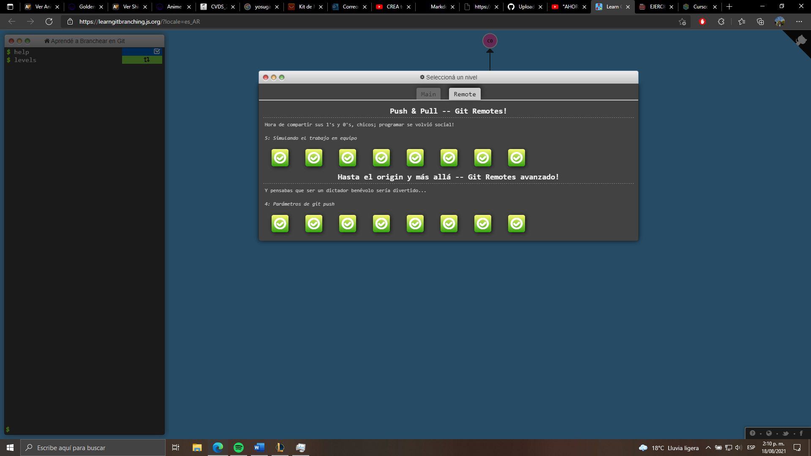

# 1. Nombre

**_Juan Mateo Mejia_**


# 2. Datos básicos

>  ### 1. Informacion General
>   - Fecha de Nacimiento: 06/10/1999
>   - Pais de nacimiento : Colombia
>   - Ciudad de Nacimiento: Bogotá
>   - Institucion Educativa: Escuela Colombiana de Ingenieria Julio Garavito
>
>  ### 2. Historia academica
>  Estudie en el [*Jardin campestre del norte*]( https://www.jcn.edu.co/ ) luego de eso inicie primaria y me gradue en el [*Stella Matutina*](http://stellamatutina.edu.co/) actualmente , estudio actualmente en la [*Escuela Colombiana de Ingenieria Julio Garavito*](https://www.escuelaing.edu.co/es/comunidad/estudiantes)

# 3. Intereses

> ### Jugar videojuegos
> #### Juego favorito:
>   League of legends 
>   
> ### Otros intereces 
> #### Programar
>   Acá hay un ejemplo de un programa en Java :
```
 public class Basico { 
   public static void main(String args[]) {
	System.out.println("Hola mundo");
    }
}
```

# 4. Punto 4

**Ejercicios main**\
**Juan Mateo Mejia**\
**Carnet : 2154840**


**Ejercicios remote**


